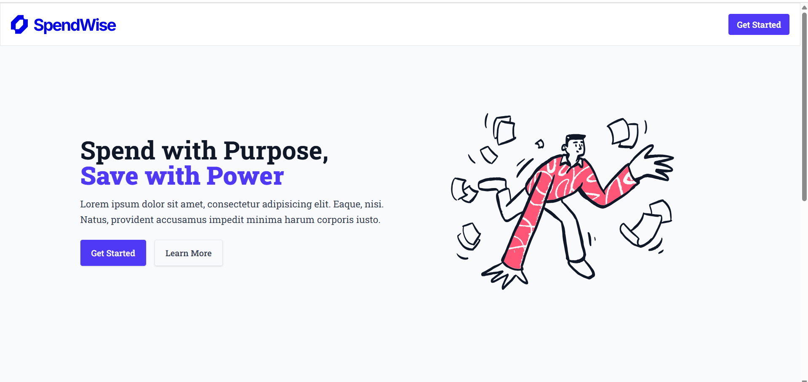
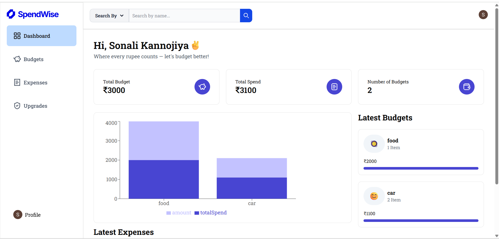
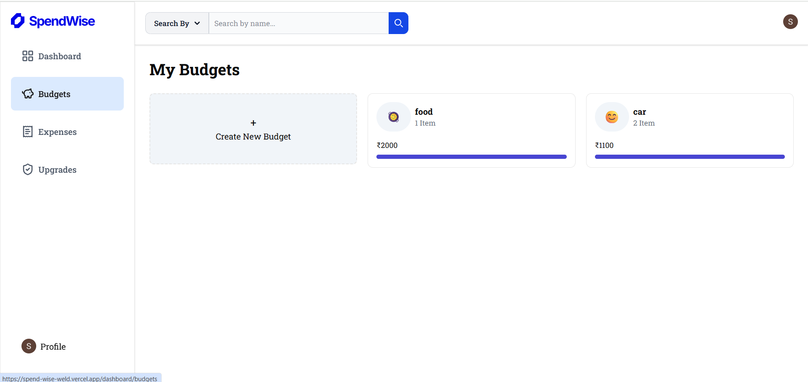
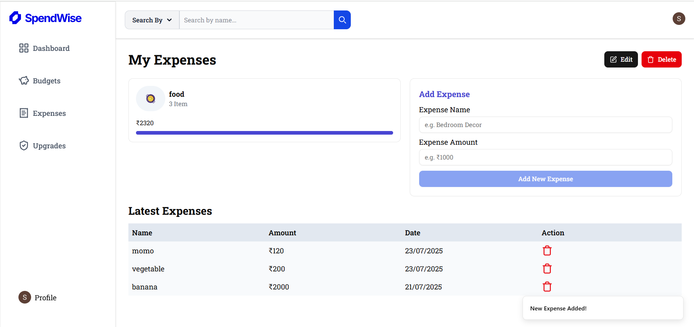

# 💸 Expense Tracker App

A full-stack Expense Tracker web application to help you manage and visualize your spending. Built with **Next.js 14**, **Tailwind CSS**, **Drizzle ORM**, and **PostgreSQL** (hosted on **NeonDB**). Includes secure user authentication via **Clerk**.

## ✨ Features

- 🔐 User authentication with Clerk
- 📦 Store & manage personal expenses
- 🏷️ Category tagging for each expense
- 📊 Dynamic dashboard with analytics
- 🔎 Filter expenses by date, category, and amount
- ⚙️ Environment variables for secure config

---

## 🔗 Live Demo

🌐 **[Click here to try it out](https://spend-wise-weld.vercel.app/)**  
---


## 📸 Screenshots

| Page | Preview |
|------|---------|
| **Home Page** |  |
| **Dashboard** |  |
| **Create Budget** |  |
| **Add Expense** |  |


## 🛠️ Tech Stack

| Tech             | Description                                |
|------------------|--------------------------------------------|
| **Next.js**      | React-based framework for SSR and routing  |
| **Tailwind CSS** | Utility-first CSS framework                |
| **Clerk**        | User authentication and session handling   |
| **Drizzle ORM**  | Type-safe SQL ORM for database operations  |
| **PostgreSQL**   | Relational database hosted on NeonDB       |
| **Vercel**       | Deployment and hosting                     |

---


## 🧰 Getting Started

To run this project locally, follow these steps:

### 1. **Clone the Repository**

```bash
git clone https://github.com/your-username/spendwise.git
cd spendwise
npm install
npm run dev

